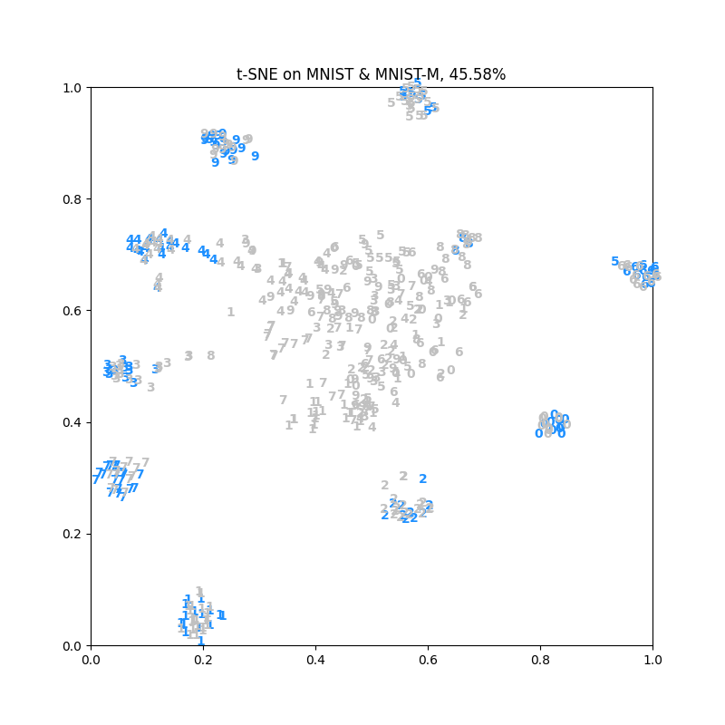
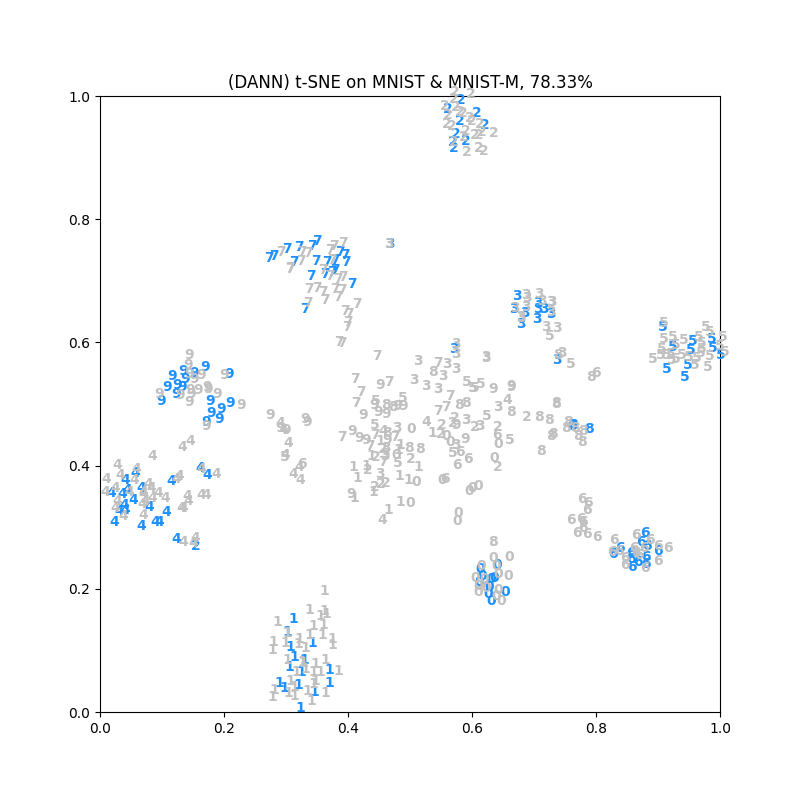

### Testing Accuracy
- Source Dataset (MNIST)
- Target Dataset (MNIST-M)

| w/o Domain Adaptation | Domain Adaptation |
| :-: | :-: |
| 45% | 77% |

### t-SNE Visualization
| w/o Domain Adaptation | Domain Adaptation |
| :-: | :-: |
|  |  |