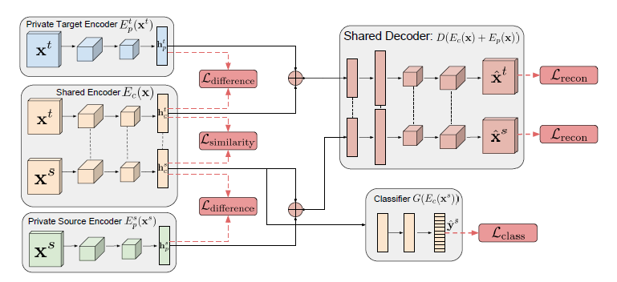

# PyTorch Implementation of Domain Separation Networks

[Domain Separation Networks](https://arxiv.org/abs/1608.06019) is a method to learn domain-invariant representations of data from multiple domains. This repository is a PyTorch implementation of the paper with a slightly modified model architecture. Moreover, I compared the performance of the model with different output dimensions of shared and private encoders.

## Result
### Shared Encoder > Private Encoder
| Shared_dim | Private_dim | Accuracy |
| :-: | :-: | :-: |
| 64 | 32 | 84.21% |
| 128 | 64 | 84.14% |
| 256 | 128 | 83.30% |

### Shared Encoder = Private Encoder
| Shared_dim | Private_dim | Accuracy |
| :-: | :-: | :-: |
| 64 | 64 | 80.84% |
| 128 | 128 | 84.13% |

### Shared Encoder < Private Encoder
| Shared_dim | Private_dim | Accuracy |
| :-: | :-: | :-: |
| 32 | 64 | 80.04% |
| 48 | 64 | 82.89% |
| 64 | 128 | 85.25% |
| 64 | 256 | 82.55% |
| 128 | 256 | 82.94% |